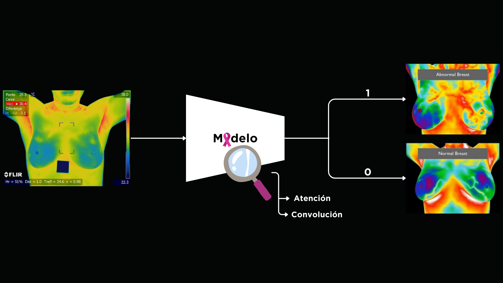

<div align="center">
  
# Breast cancer diagnosis with deep learning models using thermal imaging

<a href="#">
  
</a>

[Guillermo Pinto](https://github.com/guillepinto), [Miguel Pimiento](https://github.com/pimientoyolo125), Cristian Diaz, [Hoover Rueda-Chacón](https://scholar.google.com/citations?user=seyRms4AAAAJ&hl=es&oi=sra)

Research Group: [Hands-on Computer Vision](https://github.com/semilleroCV)

### Paper | [Project Page](https://semillerocv.github.io/proyectos/proyecto7.html)

> **Abstract:** We developed a computer vision approach for the detection of breast cancer-related abnormalities using vision transformers and convolutional neural networks applied to the Database for Research Mastology with Infrared Image (DMR-IR) thermography dataset, achieving an accuracy of 95.30%. To our knowledge, this is the first work to implement cross-validation on this dataset, which reinforces the robustness of our best model compared to previous studies that did not apply this methodology. We implemented advanced visual attention techniques, such as GradCAM, to improve the interpretability of the predictions. This achievement underscores the potential of deep learning models in conjunction with thermograms, opening new opportunities for clinical applications in the early and efficient detection of breast cancer.

</div> 

</br>

<p align="center">  </p>

**Overview:** Our approach focuses on applying transfer learning from ImageNet-pretrained models, specifically Vision Transformers (ViT) and convolutional neural networks (CNNs), to thermal imaging in the medical domain. By fine-tuning these models on the DMR-IR dataset, we were able to leverage the knowledge learned from large-scale natural image datasets and adapt it to breast cancer detection using thermography.

## Dataset

Our dataset consists of thermal images, each infrared image has a dimension of 640 × 480 pixels; the soft­ware creates two types of files: (i) a heat-map file; (ii) a matrix with 640 × 480 points, e.g. 307,200 thermal points. Download the thermal image dataset from the [link provided](https://visual.ic.uff.br/en/proeng/thiagoelias/). The DMR-IR dataset is organized as follows:

```
dataset/
├── DOENTES/
│   ├── 256/
│   │   ├── Matrizes/
│   │   │   └── PAC_62_DN0.txt
│   │   └── Segmentadas/
│   │       └── PAC_62_DN0-dir.png
│   └── ...
└── SAUDAтХа├╝VEIS/
    ├── 50/
    │   ├── Matrizes/
    │   │   └── PAC_14_DN0.txt
    │   └── Segmentadas/
    │       └── PAC_14_DN0-dir.png
    └── ...
```

## Training and Evaluation

We utilized 7-fold cross-validation to ensure the robustness of our models. The dataset was split into 7 folds, and for each fold, we trained a separate model, resulting in 7 models for evaluation. Each model was trained using the same hyperparameters and techniques, allowing us to assess performance across different subsets of the data.

Our experiments were conducted using ViT and CNN models, including:

- Vision Transformers (ViT)
- ResNet
- Xception

For each model, transfer learning was applied using weights pretrained on ImageNet, and the models were fine-tuned for classification of thermographic breast cancer images. Best models and their hyperparameters can be found in the following [notebook](/notebooks/bests-models.ipynb).

## Usage

### Installation

To to run the experiments and replicate the results, follow these steps:

1. Install the Conda environment specified in the `Makefile`:
```bash
# This will create a Conda environment named `thermal-breast-cancer` with Python 3.10.
make create_environment
```
   
2. Activate the Conda environment:
```bash
conda activate thermal-breast-cancer
```
3. Install the Python dependencies specified in the `requirements.txt` file:
```bash
# This will install all the required libraries to run the experiments.
make requirements
```
 4. Run experiments
```bash
# This will run the experiments for the 7 folds with the best hyperparameters for ViT.
python run_gkfold.py
```

### Checkpoints

To facilitate the verification of our results, we provide our checkpoints for the `DMR-IR dataset`. Please download it from the following [link](https://huggingface.co/SemilleroCV/vit-base-patch16-224-thermal-breast-cancer).

### Notebooks for inference

We have created a [notebook](/notebooks/validation.ipynb) to perform the evaluation of the 7 checkpoints for our best model `vit-base-patch16-224`. 


## Results

Our experiments showed that the Vision Transformer achieved an accuracy of 95.30% on the DMR-IR dataset, surpassing the results reported in prior works. The fine-tuned ViT model outperformed CNN-based models, although all models achieved competitive results, highlighting the potential of modern deep learning architectures in the field of medical imaging.

| Model                               | Accuracy                | F1-score                | Precision               | Recall                  |
|--------------------------------------|-------------------------|-------------------------|-------------------------|-------------------------|
| SeResNet18 (Zuluaga-Gomez et al., 2021) | 0.90                    | 0.91                    | 0.91                    | 0.90                    |
| CNN-Hyp 1 (Zuluaga-Gomez et al., 2021) | 0.94                    | 0.91                    | 0.92                    | 0.92                    |
| ViT-B-16 (Full)                      | **0.9530 (± 0.0381)**    | **0.9483 (± 0.0453)**    | 0.9957 (± 0.0075)    | 0.9110 (± 0.0788)       |
| ResNet-152 (Full + Adam)             | 0.9519 (± 0.0414)       | 0.9433 (± 0.0560)       | 0.9953 (± 0.0055)       | 0.9113 (± 0.0943)       |
| ViT-B-16 (Classifier+conv1)          | 0.9087 (± 0.0568)       | 0.9167 (± 0.0523)       | 0.9063 (± 0.0969)       | **0.9390 (± 0.0591)**   |
| ResNet-152 (Full + SGD)              | 0.9231 (± 0.0525)       | 0.9093 (± 0.0722)       | **1.0000 (± 0.0000)**    | 0.8439 (± 0.1165)       |


## Acknowledgements

We would like to thank the researchers and institutions that provided access to the [DMR-IR dataset](https://visual.ic.uff.br/dmi/), as well on methodologies proposed by Juan Pablo Zuluaga et al. in their [paper](https://www.tandfonline.com/doi/abs/10.1080/21681163.2020.1824685?casa_token=Ctl3_oQAaqMAAAAA:pZFxQTFyVI4UQGYq1ZHDj4WcoKFeOSaVUFVDl-pxztByl7Qob5NAqp2y-6bpmzGvoRFsQiofsbZ3) *"A CNN-based methodology for breast cancer diagnosis using thermal images"*. 

## Citation

If you find our code or paper useful, please cite:
```bibtex
@techreport{pinto2024ThermalBC,
  title={Detección de anomalías relacionadas con el cáncer de mama utilizando modelos de aprendizaje profundo e imágenes térmicas},
  author={Pinto, Guillermo and Pimiento, Miguel and Diaz, Cristian and Rueda-Chacón, Hoover},
  institution={Preprint, Universidad Industrial de Santander},
  year={2024},
  note={Technical Report, available at \url{https://github.com/guillepinto/Fine-Tuned-Thermal-Breast-Cancer-Diagnosis}},
}
```

## License

This project is licensed under the MIT License - see the [LICENSE](https://github.com/guillepinto/Fine-Tuned-Thermal-Breast-Cancer-Diagnosis/blob/main/LICENSE) file for details.

## Contact

For inquiries, please contact: guillermo2210069@correo.uis.edu.co
